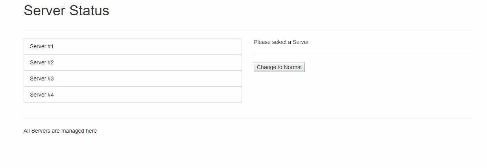

# WEB 2630 Exercise 4
> In this exercise, you will be practicing separating code in your application and putting that code in its own component. This exercise can be tricky due to all the different ways we can communicate data. My tip is to use a mix but try using the event bus approach.

## Exercise Steps

1. Create WEB2630_Exercise4 Repository on GitHub
    * Note: Make Repository Private
2. Open Terminal or Command Prompt
    1. Clone Template
        * git clone --bare https://github.com/CodySquadroni/WEB2630_Exercise4
            * Note: Make sure to 'cd' to a directory you want it downloaded to.
    2. cd Into WEB2630_Exercise4.git
    3. Copy Template Into Your Repository
        * git push --mirror https://github.com/GITHUB_USERNAME/WEB2630_Exercise4
            * Note: Make sure to put your GitHub Username in place of GITHUB_USERNAME
    4. Remove Copy WEB2630_Exercise4.git
    5. Clone Your GitHub Repository
        * git clone https://github.com/GITHUB_USERNAME/WEB2630_Exercise4
3. Complete The Exercise ToDo's located in main.js, Server.vue, Servers.vue, and ServerDetails.vue
4. Connect WEB2630_Exercise4 to Netlify
5. Submit Your GitHub and Netlify URL on Canvas

**Note: Remember to make your GitHub repository private and add me as a collaborator GitHub username: CodySquadroni**

## Final Outcome



# Commands
## Project setup
```
npm install
```

### Compiles and hot-reloads for development
```
npm run serve
```

### Compiles and minifies for production
```
npm run build
```

### Run your tests
```
npm run test
```

### Lints and fixes files
```
npm run lint
```

### Customize configuration
See [Configuration Reference](https://cli.vuejs.org/config/).
